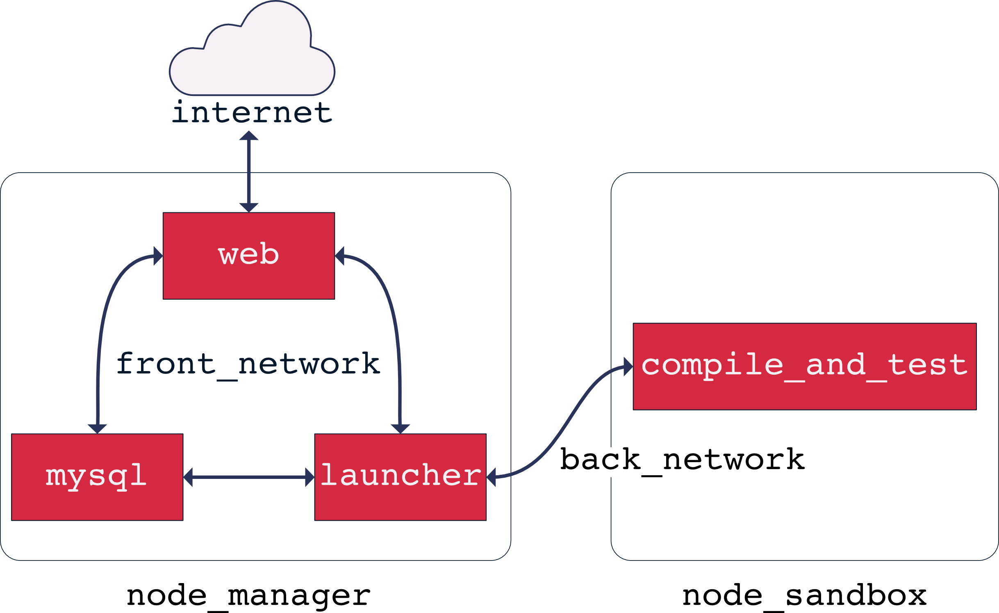
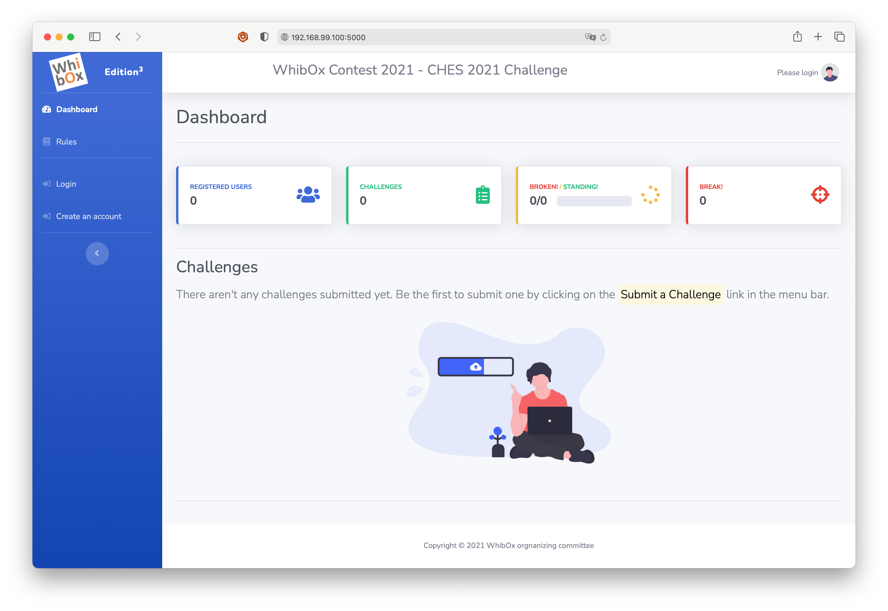

# Whitebox Contest Submission Server

Source code of the Whitebox Contest Submission Server

## About

This repository contains the full source code of the server managing the WhibOx Contest organized within [WhibOx 2016][whibox], a one-time workshop on white-box cryptography and obfuscation organized by [CryptoExperts][crx] on behalf of the ECRYPT CSA european initiative.

For more information about the WhibOx Contest, please visit the [WhibOx Contest official website][contest].

## Disclaimer

This software is supplied **AS IS** without any warranties. We had a *very* tight time schedule, so please do not expect clean code. Seriously. Any code linter would probably raise more warnings than the total number of code lines in the Python source files. Also note that the aim of this project is basically the exact opposite of what one would typically expect from a webserver: it allows anyone to submit some source code (potentially malicious source code). Then, it compiles and runs this code!

## About the architecture

The server is essentially made of 4 [Docker][docker] services :

* The `web` service, which is a typical [Flask][flask] application in charge of displaying dynamic web content to the users,
* The `mysql` service, which runs a [MySQL][mysql] database,
* The `compile_and_test` service, which compiles the challenges submitted by the contest participant and that tests the compiled challenge against the cryptographic key, and
* The `launcher` service, which prepares and runs a `compile_and_test` service whenever a new challenge is submitted.

Those 4 services are deployed in a [Docker swarm][docker_swarm] which is intended to run on two nodes (the `node_manager` and the `node_sandbox`). In our context, a node typically is a [Virtualbox][virtualbox] virtual machine. The `compile_and_test` service is only allowed to run on the `node_sandbox` while the 3 other services can only run on the `node_manager`.

When running in [Production mode](#running-the-server-in-production-mode), the only publicly accessible service is the `web` service. Moreover, the only service allowed to communicate with all the other services is the `launcher` service. This feature is ensured by connecting the services by means of two distinct (virtual) networks: the `front_network` and the `back_network`. The following diagram illustrates the connections between the four services and how they are deployed on the two nodes:

## Installation procedure

## Prerequisites

In order to run this server, you need to install the following softwares first:

* [VirtualBox][virtualbox] (tested on version 5.1.18)
* Docker Engine (tested on Docker version 17.03.1)
* Docker Machine (tested on version 0.10.0)
* Make (tested on versions 3.81 and 4.2.1 😉)

For Mac users, note that Docker Machine is included by default when installing [Docker for Mac][docker_for_mac].

This software was tested on [macOS Sierra][sierra] and on a [Gentoo Linux][gentoo].

## Production vs. Developement

There are two ways this server can be deployed:

* In **developement** mode, for testing, updating the code on the fly and immediately seing the result;
* In **production** mode.

### Running the server in Production mode

#### Step 1: Create the virtual machines and the Docker swarm

In a terminal, change the current directory to the root of this git repository and type:

~~~bash
> make machines-and-swarm
/bin/bash scripts/create_machines_and_swarm.sh
Configuring the node-manager VM
Running pre-create checks...
Creating machine...
(node-manager) Copying /.../.docker/machine/cache/boot2docker.iso to /.../.docker/machine/machines/node-manager/boot2docker.iso...
(node-manager) Creating VirtualBox VM...
(node-manager) Creating SSH key...
(node-manager) Starting the VM...
(node-manager) Check network to re-create if needed...
(node-manager) Waiting for an IP...
Waiting for machine to be running, this may take a few minutes...
[...]
Waiting for VM "node-manager" to power on...
VM "node-manager" has been successfully started.
Waiting for VM to startup...
..VM is up
Configuring the node-sandbox VM
Running pre-create checks...
Creating machine...
(node-sandbox) Copying /.../.docker/machine/cache/boot2docker.iso to /.../.docker/machine/machines/node-sandbox/boot2docker.iso...
(node-sandbox) Creating VirtualBox VM...
(node-sandbox) Creating SSH key...
(node-sandbox) Starting the VM...
(node-sandbox) Check network to re-create if needed...
(node-sandbox) Waiting for an IP...
Waiting for machine to be running, this may take a few minutes...
[...]
VM is up
Creating the swarm
Swarm initialized: current node (x6vn6qv2v46ujobt8051dyvsq) is now a manager.

To add a worker to this swarm, run the following command:

    docker swarm join \
    --token SWMTKN-1-0arjnc26xfshb4rmxor29kv7ta4hywyo28syjxvculapq84ogx-0jwbslbvza1y6uxr5jknlgzwa \
    192.168.99.100:2377

To add a manager to this swarm, run 'docker swarm join-token manager' and follow the instructions.

node-manager
Joining the swarm
This node joined a swarm as a worker.
node-sandbox

~~~

This will create 2 VirtualBox VMs, called `node-manager` and `node-sandbox`, and unite them into a Docker swarm. This takes a few minutes. One can check that the two VMs were successfully created:

~~~bash
> docker-machine ls
NAME           ACTIVE   DRIVER       STATE     URL                         SWARM   DOCKER        ERRORS
node-manager   -        virtualbox   Running   tcp://192.168.99.100:2376           v17.03.1-ce
node-sandbox   -        virtualbox   Running   tcp://192.168.99.101:2376           v17.03.1-ce
~~~

To stop both VMs:

~~~bash
> make machines-stop
docker stack rm dev 1>/dev/null 2>&1
make: [machines-stop] Error 1 (ignored)
docker stack rm prod 1>/dev/null 2>&1
make: [machines-stop] Error 1 (ignored)
docker-machine stop node-manager
Stopping "node-manager"...
Machine "node-manager" was stopped.
docker-machine stop node-sandbox
Stopping "node-sandbox"...
Machine "node-sandbox" was stopped.
> docker-machine ls
NAME           ACTIVE   DRIVER       STATE     URL   SWARM   DOCKER    ERRORS
node-manager   -        virtualbox   Stopped                 Unknown
node-sandbox   -        virtualbox   Stopped                 Unknown
~~~

To turn them back on:

~~~bash
> make machines-start
~~~

#### Step 2: Change the Docker commands target

Instead of ssh-ing to the `node-manager` VM, it is more convenient to set a few environment variables to automagically send the docker commands to the Docker deamon running on the `node-manager`. This can be done by running:

~~~bash
> eval $(docker-machine env node-manager)
~~~

#### Step 3: Build the service images

To build the service images, run:

~~~bash
> make build-prod
~~~

This takes quite a long time. It builds images required on both nodes. Once this process is over:

~~~bash
> docker images
REPOSITORY          TAG                 IMAGE ID            CREATED              SIZE
crx/launcher-prod   latest              672caddc5e5f        5 seconds ago        185 MB
crx/web-prod        latest              f311d2c046ad        31 seconds ago       257 MB
crx/nginx           latest              0c4fd97fd779        About a minute ago   57.7 MB
crx/mysql           latest              f33520248854        3 minutes ago        433 MB
debian              jessie              8cedef9d7368        9 days ago           123 MB
alpine              3.5                 4a415e366388        3 weeks ago          3.99 MB
> docker-machine ssh node-sandbox docker images
REPOSITORY             TAG                 IMAGE ID            CREATED             SIZE
crx/compile_and_test   latest              60a2c138871f        7 minutes ago       157 MB
alpine                 3.5                 4a415e366388        3 weeks ago         3.99 MB
~~~

#### Step 4: Configure the services

A few parameters **must** be changed in the `docker-stack-prod.yml` file before the server can be run. These parameters are indicated by a `>` sign:

~~~yaml
version: "3"

services:

    web:
        image: crx/web-prod
        networks:
            - front_network
        ports:
>           - 5000:5000 # The first number is the external port and can be changed, e.g., to 80:5000 (the second number must not be changed)
        volumes:
            - /volumes/whitebox_program_uploads:/uploads
        environment:
>           - RECAPTCHA_PUBLIC_KEY=6Le3QBoUAAAAANKiIexuJsV5XE_HjgqICK2kHGCb
>           - RECAPTCHA_PRIVATE_KEY=6Le3QBoUAAAAALLIh0LrUMsIT8F1lV5fr3eqzj4x
            - SECRET_KEY=da39a3ee5e6b4b0d3255bfef95601890afd80709
            - MYSQL_DATABASE=db_wb
            - MYSQL_USER=user_wb
>           - MYSQL_PASSWORD=a_not_so_random_user_password # Must be identical in web, launcher and mysql services.
            - MYSQL_HOST=mysql
            - MYSQL_PORT=3306
            - UPLOAD_FOLDER=/uploads
            - URL_COMPILE_AND_TEST=http://launcher:5000/compile_and_test
            - STARTING_DATE=1494806400 # In seconds since EPOCH. Must be identical in the launcher service. 15/5/2017 00:00 UTC is 1494806400
            - POSTING_DEADLINE=1504223940 # In seconds since EPOCH. Must be identical in the launcher service. 31/8/2017 23:59 UTC is 1504223940
            - FINAL_DEADLINE=1506254400 # In seconds since EPOCH. Must be identical in the launcher service. 24/9/2017 12:00 UTC is 1506254400
            - CHALLENGE_MAX_SOURCE_SIZE_IN_MB=50 # In MB. Must be identical in the launcher service. Must be 50 in production.
            - CHALLENGE_MAX_MEM_COMPILATION_IN_MB=500 # In MB. Must be identical in the launcher service. Must be 500 in production.
            - CHALLENGE_MAX_TIME_COMPILATION_IN_SECS=100 # In seconds. Must be identical in the launcher service. Must be 100 in production.
            - CHALLENGE_MAX_BINARY_SIZE_IN_MB=20 # In MB. Must be identical in the launcher service. Must be 20 in production.
            - CHALLENGE_MAX_MEM_EXECUTION_IN_MB=20 # In MB. Must be identical in the launcher service. Must be 20 in production.
            - CHALLENGE_MAX_TIME_EXECUTION_IN_SECS=1 # In seconds. Must be identical in the launcher service. Must be 1 in production.
            - CHALLENGE_NUMBER_OF_TEST_VECTORS=1000 # Must be identical in the launcher service. Must be at least 1000 in production.
        deploy:
            placement:
                constraints: [node.labels.vm == node-manager]

    launcher:
        image: crx/launcher-prod
        networks:
            - front_network
            - back_network
        volumes:
            - /var/run/docker.sock:/var/run/docker.sock
            - /volumes/whitebox_program_uploads:/uploads:ro
        environment:
            - MYSQL_DATABASE=db_wb
            - MYSQL_USER=user_wb
>           - MYSQL_PASSWORD=a_not_so_random_user_password # Must be identical in web, launcher and mysql services.
            - MYSQL_HOST=mysql
            - MYSQL_PORT=3306
            - SOCK=unix:///var/run/docker.sock
            - NAME_OF_COMPILE_AND_TEST_SERVICE=prod_compile_and_test
            - COMPILE_AND_TEST_SERVICE_NETWORK=prod_back_network
            - STARTING_DATE=1494806400 # In seconds since EPOCH. Must be identical in the web service. 15/5/2017 00:00 UTC is 1494806400
            - POSTING_DEADLINE=1504223940 # In seconds since EPOCH. Must be identical in the web service. 31/8/2017 23:59 UTC is 1504223940
            - FINAL_DEADLINE=1506254400 # In seconds since EPOCH. Must be identical in the web service. 24/9/2017 12:00 UTC is 1506254400
            - CHALLENGE_MAX_SOURCE_SIZE_IN_MB=50 # In MB. Must be identical in the web service. Must be 50 in production.
            - CHALLENGE_MAX_MEM_COMPILATION_IN_MB=500 # In MB. Must be identical in the web service. Must be 500 in production.
            - CHALLENGE_MAX_TIME_COMPILATION_IN_SECS=100 # In seconds. Must be identical in the web service. Must be 100 in production.
            - CHALLENGE_MAX_BINARY_SIZE_IN_MB=20 # In MB. Must be identical in the web service. Must be 20 in production.
            - CHALLENGE_MAX_MEM_EXECUTION_IN_MB=20 # In MB. Must be identical in the web service. Must be 20 in production.
            - CHALLENGE_MAX_TIME_EXECUTION_IN_SECS=1 # In seconds. Must be identical in the web service. Must be 1 in production.
            - CHALLENGE_NUMBER_OF_TEST_VECTORS=1000 # Must be identical in the web service. Must be at least 1000 in production.

        deploy:
            placement:
                constraints: [node.labels.vm == node-manager]

    mysql:
        image: crx/mysql
        networks:
            - front_network
        volumes:
            - /volumes/database:/var/lib/mysql
        environment:
>           - MYSQL_ROOT_PASSWORD=a_not_so_random_root_password
            - MYSQL_DATABASE=db_wb # specify the name of a database to be created on image startup (does nothing if the db already exists).
            - MYSQL_USER=user_wb # This user will be granted superuser permissions for the database specified by the MYSQL_DATABASE variable.
>           - MYSQL_PASSWORD=a_not_so_random_user_password # Must be identical in web, launcher and mysql services.
            - MYSQL_ALLOW_EMPTY_PASSWORD=no
        deploy:
            placement:
                constraints: [node.labels.vm == node-manager]

networks:
    front_network:
    back_network:
~~~

#### Step 5: Launch the services on the swarm

To launch the services:

~~~bash
> make stack-deploy-prod
docker stack deploy -c docker-stack-prod.yml prod
Creating network prod_front_network
Creating network prod_back_network
Creating service prod_web
Creating service prod_launcher
Creating service prod_mysql
~~~

One can check that the `web`, `mysql`, and `launcher` services run on the `node-manager`:

~~~bash
> docker service ls
ID            NAME           MODE        REPLICAS  IMAGE
j1lpg8y7e9rk  prod_web       replicated  1/1       crx/web-prod
jlxvxld4vlix  prod_mysql     replicated  1/1       crx/mysql
z24nkvnrgbsl  prod_launcher  replicated  1/1       crx/launcher-prod
> docker ps
CONTAINER ID        IMAGE                      COMMAND                  CREATED              STATUS              PORTS               NAMES
329e3119f5c3        crx/mysql:latest           "docker-entrypoint..."   About a minute ago   Up About a minute   3306/tcp            prod_mysql.1.nuuib7aep6euqmyoxzpb9nuv8
b29c6476776a        crx/launcher-prod:latest   "docker-entrypoint..."   About a minute ago   Up About a minute   80/tcp, 443/tcp     prod_launcher.1.t3dktjuevknl6wgrhqz01xz6v
400da0af4e6c        crx/web-prod:latest        "docker-entrypoint..."   About a minute ago   Up About a minute   80/tcp, 443/tcp     prod_web.1.t8np0zqs7wwx886uq2o0fksjt
~~~

Note that **no** service runs on the `node-sandbox`:

~~~bash
> docker-machine ssh node-sandbox docker ps
CONTAINER ID        IMAGE               COMMAND             CREATED             STATUS              PORTS               NAMES
~~~

The `compile_and_test` service runs on-demand, once per challenge to compile.

#### Step 6: Connecting the web service

The first time the services are launched, the `mysql` service creates a database and initializes it. This takes a few seconds. In the meantime, the `web` service waits. This can be checked:

~~~bash
> docker ps
CONTAINER ID        IMAGE                      COMMAND                  CREATED             STATUS              PORTS               NAMES
329e3119f5c3        crx/mysql:latest           "docker-entrypoint..."   8 minutes ago       Up 8 minutes        3306/tcp            prod_mysql.1.nuuib7aep6euqmyoxzpb9nuv8
b29c6476776a        crx/launcher-prod:latest   "docker-entrypoint..."   8 minutes ago       Up 8 minutes        80/tcp, 443/tcp     prod_launcher.1.t3dktjuevknl6wgrhqz01xz6v
400da0af4e6c        crx/web-prod:latest        "docker-entrypoint..."   8 minutes ago       Up 8 minutes        80/tcp, 443/tcp     prod_web.1.t8np0zqs7wwx886uq2o0fksjt
> docker logs prod_web.1.t8np0zqs7wwx886uq2o0fksjt
Mysql is unavailable yet - sleeping
Mysql is unavailable yet - sleeping
Mysql is unavailable yet - sleeping
Mysql is unavailable yet - sleeping
Mysql is unavailable yet - sleeping
Mysql is unavailable yet - sleeping
Mysql is unavailable yet - sleeping
Mysql is unavailable yet - sleeping
Mysql is unavailable yet - sleeping
Mysql is unavailable yet - sleeping
Mysql is unavailable yet - sleeping
Mysql is unavailable yet - sleeping
Mysql is unavailable yet - sleeping
Mysql is unavailable yet - sleeping
Mysql is unavailable yet - sleeping
Mysql is unavailable yet - sleeping
Mysql is up !
[uWSGI] getting INI configuration from /etc/uwsgi.ini
*** Starting uWSGI 2.0.14 (64bit) on [Fri Mar 31 14:35:35 2017] ***
compiled with version: 6.2.1 20160822 on 22 February 2017 22:05:04
os: Linux-4.4.57-boot2docker #1 SMP Tue Mar 28 17:53:18 UTC 2017
nodename: 400da0af4e6c
machine: x86_64
clock source: unix
pcre jit disabled
detected number of CPU cores: 1
current working directory: /
detected binary path: /usr/sbin/uwsgi
uWSGI running as root, you can use --uid/--gid/--chroot options
*** WARNING: you are running uWSGI as root !!! (use the --uid flag) ***
chdir() to /etc/..
your processes number limit is 1048576
your memory page size is 4096 bytes
detected max file descriptor number: 1048576
lock engine: pthread robust mutexes
thunder lock: disabled (you can enable it with --thunder-lock)
uwsgi socket 0 bound to UNIX address /tmp/uwsgi.sock fd 3
Python version: 3.5.2 (default, Dec 22 2016, 10:15:38)  [GCC 6.2.1 20160822]
*** Python threads support is disabled. You can enable it with --enable-threads ***
Python main interpreter initialized at 0x558e29ded100
your server socket listen backlog is limited to 100 connections
your mercy for graceful operations on workers is 60 seconds
mapped 363840 bytes (355 KB) for 4 cores
*** Operational MODE: preforking ***
WSGI app 0 (mountpoint='') ready in 1 seconds on interpreter 0x558e29ded100 pid: 1 (default app)
*** uWSGI is running in multiple interpreter mode ***
spawned uWSGI master process (pid: 1)
spawned uWSGI worker 1 (pid: 58, cores: 1)
spawned uWSGI worker 2 (pid: 59, cores: 1)
spawned uWSGI worker 3 (pid: 60, cores: 1)
spawned uWSGI worker 4 (pid: 61, cores: 1)
~~~

Once the `web` service has started, it is possible to fire up a browser and connect to `http://192.168.99.100:5000`. You can run the following command to get exact IP address of the `node-manager`:

~~~bash
> docker-machine env node-manager | grep HOST
export DOCKER_HOST="tcp://192.168.99.100:2376"
~~~

Note that connecting to the IP address of the `node-sandbox` would also work (thanks to Docker swarm).

#### Step 7: Forward the host port

At this point, the service is only accessible from the host, not to computers on the same network. We can make the service available to the outside world through the [port forwarding feature of VirtualBox][virtualbox_port_forwarding]. Note that configuring port forwarding as described bellow requires to stop the VMs. Here is how to do it:

~~~bash
> make machines-stop
> VBoxManage modifyvm "node-manager" --natpf1 "tcp-port5000,tcp,,5000,,5000";
> make machines-start
> make stack-deploy-prod
~~~

After a few seconds, the service should be accessible from the outside world on port `5000` of the host running VirtualBox.

#### Step 8: Shutdown the swarm and the VMs

To properly shutdown the services:

~~~bash
> make stack-rm-prod
docker stack rm prod
Removing service prod_web
Removing service prod_mysql
Removing service prod_launcher
Removing network prod_front_network
Removing network prod_back_network
~~~

Although this commands looks instantaneous, it takes a few seconds for the services to actually stop. This can be seen by running:

~~~bash
> docker ps
CONTAINER ID        IMAGE                      COMMAND                  CREATED             STATUS              PORTS               NAMES
b29c6476776a        crx/launcher-prod:latest   "docker-entrypoint..."   15 minutes ago      Up 15 minutes       80/tcp, 443/tcp     prod_launcher.1.t3dktjuevknl6wgrhqz01xz6v
400da0af4e6c        crx/web-prod:latest        "docker-entrypoint..."   15 minutes ago      Up 15 minutes       80/tcp, 443/tcp     prod_web.1.t8np0zqs7wwx886uq2o0fksjt
> docker ps
CONTAINER ID        IMAGE               COMMAND             CREATED             STATUS              PORTS               NAMES
~~~

Once the services have shutdown, one can shutdown the VMs:

~~~bash
> make machines-stop
docker stack rm dev 1>/dev/null 2>&1
docker stack rm prod 1>/dev/null 2>&1
docker-machine stop node-manager
Stopping "node-manager"...
Machine "node-manager" was stopped.
docker-machine stop node-sandbox
Stopping "node-sandbox"...
Machine "node-sandbox" was stopped.
> docker-machine ls
node-manager   -        virtualbox   Stopped                 Unknown
node-sandbox   -        virtualbox   Stopped                 Unknown
~~~

### Running the server in Production mode (TLDR version)

~~~bash
> make machines-and-swarm
> eval $(docker-machine env node-manager)
> make build-prod
> # Edit the docker-stack-prod.yml file
> make stack-deploy-prod
> # Wait for the web service (using docker logs -f)
> # Connect to http://192.168.99.100:5000
~~~

### Running the server in Developement mode (TLDR version)

~~~bash
> make machines-and-swarm
> eval $(docker-machine env node-manager)
> make build-dev
> # Edit the docker-stack-dev.yml file
> make stack-deploy-dev
> # Wait for the web service (using docker logs -f)
> # Connect to http://192.168.99.100:5000
~~~

[crx]: https://www.cryptoexperts.com/  "CryptoExperts website"
[whibox]: https://www.cryptoexperts.com/whibox2016/ "WhibOx 2016 website"
[contest]: https://whibox.cr.yp.to "WhibOx contest website"
[flask]: http://flask.pocoo.org "Flask website"
[mysql]: https://www.mysql.com "MySQL website"
[docker]: https://www.docker.com "Docker website"
[docker_swarm]: https://docs.docker.com/engine/swarm/ "Docker Swarm mode overview"
[virtualbox]: https://www.virtualbox.org "VirtualBox website"
[virtualbox_port_forwarding]: https://www.virtualbox.org/manual/ch06.html#natforward "VirtualBox documentation on port forwarding"
[docker_machine]: https://docs.docker.com/machine/overview/ "Docker Machine Overview"
[gentoo]: https://www.gentoo.org "Gentoo Linux website"
[sierra]: http://www.apple.com/lae/macos/sierra/ "macOS Sierra"
[docker_for_mac]: https://docs.docker.com/docker-for-mac/ "Docker for Mac"
